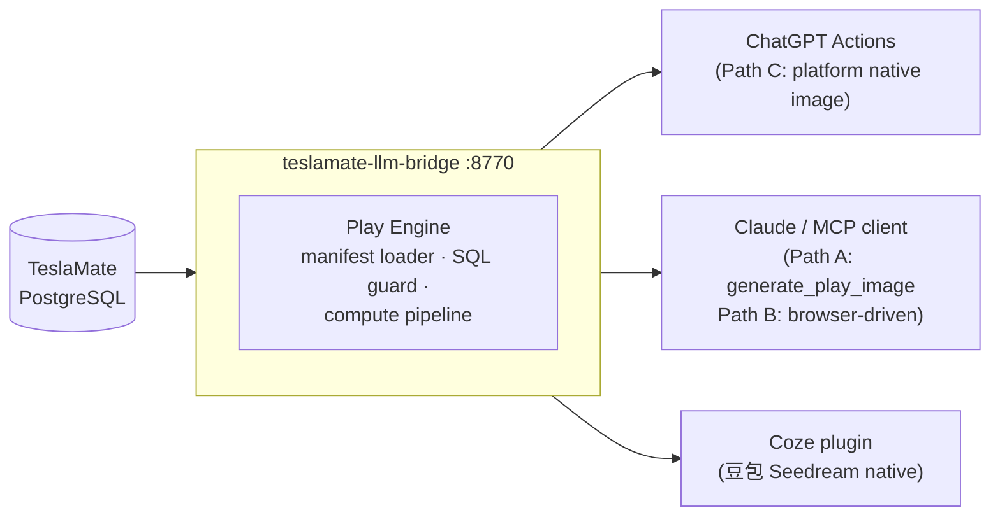

# teslamate-llm-bridge

<!-- CI badge — replace YOUR_GITHUB with your username/org before publishing -->
<!--  -->

**Bring your Tesla to any LLM platform** — driving personality scores, monthly wrapped, charging habits, and more, from your TeslaMate data.

```bash
# Demo quick start (no config needed — car_id=99 is synthetic data):
docker compose --profile demo up -d --build
# Then: curl http://localhost:8770/api/v1/cars/99/play/driving-personality
#
# Production (requires TeslaMate DB — copy .env.example to .env first):
# docker compose --profile prod up -d --build
# Then use your actual car_id: curl http://localhost:8770/api/v1/cars/1/play/driving-personality
```

## Gallery

| driving-personality FNLE「午夜高速战神」 | monthly-wrapped demo（30 天 1222 km） |
|---|---|
|  |  |

*Both images generated from demo data using Seedream 4.0 via `generate_play_image` MCP tool.*

> **AI agents:** see [AGENTS.md](AGENTS.md) to add a play in ~10 min — no Java or Python required.

> **Do not want to self-host?** Hosted version at [tesla.shenqinqin.com](https://tesla.shenqinqin.com) (China) — bind your car in 1 minute.

---

## What is this?

[TeslaMate](https://github.com/teslamate-org/teslamate) already logs everything your Tesla does into PostgreSQL. This project turns that raw data into things an LLM can actually *talk about* and *turn into social-share images*:

**Two interfaces, cleanly separated:**

```
存储（TeslaMate）
    ↓
【接口一：数据读取】  ← plays = 读什么 + 怎么算 + 生图描述模板
    ↓
结构化 JSON + creative-prompt 模板
    ↓
【接口二：生图】  ← 渠道 × 接入方式 交叉矩阵
    ↓
分享图（小红书 / 朋友圈格式）
```

- **Plays (玩法)** — small, declarative YAML manifests: one read-only SQL query + a compute pipeline (scores, levels, personas) + a `creative-prompt.md` image template. Think "Spotify Wrapped, but for your car, one card at a time".
- **Multi-platform out of the box** — the same play is exposed as a ChatGPT Actions endpoint, a Coze plugin tool, and an MCP tool. Write once, every assistant can call it.
- **Image generation via Interface 2** — three paths depending on what you have (see [AGENTS.md §Interface 2](AGENTS.md#interface-2--image-generation-guide-接口二生图使用手册)):
  - **Path A — API direct**: `ARK_API_KEY` + `generate_play_image` MCP tool → Seedream 4.0, one-command poster
  - **Path B — Browser-driven**: Agent uses Chrome MCP to operate your logged-in ChatGPT / 豆包 web page
  - **Path C — Platform native**: You are in a ChatGPT / Coze conversation, platform generates images natively
- **Safe by construction** — plays are *not* raw SQL access. Every manifest passes a JSON-Schema gate, an SQL static guard (SELECT-only, no DDL/DML, statement-level timeout, read-only transaction), and a ~150-line arithmetic-only expression language before it is ever loaded.

---

## No TeslaMate yet? Try the demo in one command

```bash
# Pull the repo, then:
docker compose --profile demo up -d --build
```

This starts a local PostgreSQL and injects 45 days of synthetic driving data (Model Y LR, Shanghai scenario, `car_id=99`) — no `.env` configuration needed.

Try any play right away:

```bash
# Driving personality
curl "http://localhost:8770/api/v1/cars/99/play/driving-personality"

# Charging habits
curl "http://localhost:8770/api/v1/cars/99/play/charging-habit"

# Monthly wrapped
curl "http://localhost:8770/api/v1/cars/99/play/monthly-wrapped"
```

> Demo data is fully synthetic — no real VIN, no real GPS coordinates, no real owner.
> VIN is `DEMO0000000000001`. See [DEMO.md](DEMO.md) for the full dataset description.

---

## Quick Start

**Full installation guides (commands are tested, not examples):**

- **[Install from scratch](docs/install-from-zero.md)** — no TeslaMate yet; covers TeslaMate + bridge in one go, demo mode, CN mirror acceleration
- **[Add bridge to existing TeslaMate](docs/install-existing-teslamate.md)** — already running TeslaMate; covers TM_DB_HOST gotcha for containerized PG, prebuilt-jar option, security

### Prerequisites

- Docker and Docker Compose
- An existing TeslaMate PostgreSQL instance (local or remote)
- Java 21+ — only needed if you prefer `java -jar` over Docker

You need to know: `TM_DB_HOST`, `TM_DB_PORT` (default `5432`), `TM_DB_NAME` (default `teslamate`), `TM_DB_USER` (default `teslamate`), `TM_DB_PASS`, and the `car_id` of your car in TeslaMate (run `SELECT id, name FROM cars;` against your TeslaMate DB to find it).

### 1. Clone the repo

```bash
git clone https://github.com/teslamate-llm-bridge/teslamate-llm-bridge.git
cd teslamate-llm-bridge
```

### 2. Configure environment

```bash
cp .env.example .env
```

Edit `.env`:

```dotenv
TM_DB_HOST=localhost          # hostname of your TeslaMate PostgreSQL
TM_DB_PORT=5432
TM_DB_NAME=teslamate
TM_DB_USER=teslamate
TM_DB_PASS=your_pg_password

# Optional: restrict to specific car IDs (comma-separated TeslaMate car IDs).
CAR_IDS=1

# Optional: require a Bearer token on /api/** endpoints.
API_TOKEN=
```

### 3. Start the bridge

```bash
docker compose --profile prod up -d
```

> **First run or after upgrading:** add `--build` to force a fresh image build:
> `docker compose --profile prod up -d --build`
> Skip `--build` on subsequent runs to reuse the cached image.

The bridge starts on port **8770**. Startup takes ~10–30 seconds on first build (Maven download), ~5 seconds on cached runs.

```bash
curl http://localhost:8770/actuator/health
# {"status":"UP"}
```

> If you see `404` for `/actuator/health`, the running image is stale. Run `docker compose --profile prod up -d --build` to rebuild.

### 4. List available plays

```bash
curl http://localhost:8770/api/v1/plays
```

### 5. Run your first play

```bash
# Demo profile: car_id is always 99
curl "http://localhost:8770/api/v1/cars/99/play/driving-personality"

# Production profile: replace 1 with your actual TeslaMate car_id
# curl "http://localhost:8770/api/v1/cars/1/play/driving-personality"
```

Sample result:

```json
{
  "data": {
    "play": "driving-personality",
    "scored": true,
    "window_days": 30,
    "code": "FNLE",
    "persona": {
      "name": "午夜高速战神",
      "desc": "别人睡了你才上高速，电门深浅全凭心情。",
      "tag": "#服务区VIP年卡用户"
    },
    "summary": "近 30 天驾驶人格 FNLE：夜驾 17%、地板电时刻 27%、单程均 22.6 公里、出车率 83%。"
  }
}
```

### 6. Generate a share image

Three paths — pick the one you have access to:

**Path A — MCP + Seedream API (recommended for Claude Code users)**

```bash
# 1. Set your ARK_API_KEY in the MCP server config (see docs/connect-claude-mcp.md)
# 2. In Claude Desktop / Codex, ask:
#    「给我做张驾驶人格分享图」
# Claude will chain: list_plays → run_play → get_creative_prompt → generate_play_image
# → returns a 1080×1920 poster like the gallery images above
```

**Path B — Browser-driven ChatGPT / 豆包**

Have an Agent use Chrome MCP to open chatgpt.com, paste the filled creative-prompt template, and save the generated image. See [AGENTS.md §路径 B](AGENTS.md#路径-b--浏览器驱动chatgpt-网页--豆包网页).

**Path C — Platform native (ChatGPT / Coze)**

Import the OpenAPI spec at `http://localhost:8770/openapi.json` into ChatGPT Actions or Coze. The platform's built-in image model (GPT Image / Seedream) generates the poster in the same conversation window.

Full image generation guide: **[docs/image-generation.md](docs/image-generation.md)**

### 7. Connect to an LLM platform

> **Security:** Before exposing the bridge to the internet, set `API_TOKEN` in your `.env` file.
> Run: `echo "API_TOKEN=$(openssl rand -hex 32)" >> .env` then `docker compose --profile prod up -d --force-recreate bridge` (**not** `restart`).

- **ChatGPT Actions** — import `http://localhost:8770/openapi.json` (needs public HTTPS URL): [docs/connect-chatgpt.md](docs/connect-chatgpt.md)
- **Claude Desktop / Cursor / Codex (MCP)** — local, no HTTPS needed: [docs/connect-claude-mcp.md](docs/connect-claude-mcp.md)
- **Coze / 扣子** — needs public HTTPS URL: [docs/connect-coze.md](docs/connect-coze.md)

### Alternative: run with `java -jar` (no Docker)

```bash
cd bridge
mvn -DskipTests package
java -Xmx256m \
  -DTM_DB_HOST=localhost \
  -DTM_DB_PASS=your_pg_password \
  -jar target/teslamate-llm-bridge-*.jar
```

### Custom plays directory

```yaml
# docker-compose.yml extension
services:
  bridge:
    environment:
      PLAYS_DIR: /plays-custom
    volumes:
      - ./my-plays:/plays-custom
```

---

## How it compares

The closest neighbor is [cobanov/teslamate-mcp](https://github.com/cobanov/teslamate-mcp) — a great, minimal MCP server that exposes predefined SQL queries over your TeslaMate database.

| | teslamate-llm-bridge | cobanov/teslamate-mcp |
|---|---|---|
| Core idea | Declarative **play framework**: query + compute pipeline + image template | MCP server with predefined raw SQL queries |
| Image output | AI-generated share posters via 3-path Interface 2 (Seedream / GPT Image / ChatGPT native) | None |
| Platforms | **ChatGPT Actions, Coze plugin, MCP** from one definition | MCP clients only |
| Sandboxing | JSON-Schema gate, SQL static guard, read-only tx, 5s timeout, arithmetic-only expr | Queries are trusted as written |
| Contribution | A `plays/<name>/` YAML folder — **no Java/Python required** | New SQL query in codebase |

---

## Architecture



---

## Included plays

| Play | What it tells you |
|---|---|
| [`driving-personality`](plays/driving-personality/) 🧬 | 16-type MBTI-style personality from vigor, night-driving, radius, and frequency axes — 4-letter code (FNLE … CDSO) with Chinese persona name |
| [`monthly-wrapped`](plays/monthly-wrapped/) 📅 | Spotify Wrapped-style monthly report — total km, active days, busiest day, night profile |
| [`charging-habit`](plays/charging-habit/) ⚡ | Charging persona from anxiety level, full-charge habit, home vs DC split |
| [`efficiency-report`](plays/efficiency-report/) 📊 | Energy efficiency grade vs TeslaMate baseline |
| [`extremes-card`](plays/extremes-card/) 🏆 | Personal records — top speed, peak power, max elevation |
| [`weekend-warrior`](plays/weekend-warrior/) 🗺️ | Weekend vs weekday driving split |
| [`ab-couple-souls`](plays/ab-couple-souls/) 💑 | Two-soul personality for couples sharing a car |

More plays: see [`plays-incubator/`](plays-incubator/) for candidates.

---

## Play manifest at a glance

```yaml
schema_version: 1
name: driving-personality
title: "驾驶人格十六型"
sql: |
  SELECT COUNT(*) AS total_drives, ... FROM drives
  WHERE car_id = :car_id AND start_date >= :start AND start_date < :end
min_sample: { field: total_drives, min: 5 }
compute:
  - var: night_ratio
    expr: "ROUND(night_drives * 100 / GREATEST(total_drives, 1))"
  - var: personality_axis
    level:
      input: night_ratio
      thresholds:
        - { lt: 20, label: "D" }
        - { label: "N" }
output:
  fields:
    - { name: code, from: code, type: string }
    - { name: persona, from: persona, type: object }
```

Each play folder: `play.yaml` (manifest) + `creative-prompt.md` (image generation templates) + `fixtures.yaml` (CI test cases).

Full specification: [`docs/play-manifest-spec.md`](docs/play-manifest-spec.md). Schema: [`plays/play.schema.json`](plays/play.schema.json).

---

## MCP (Claude Desktop / Cursor / Codex)

4 tools over `stdio` — no public HTTPS URL required:

| Tool | What it does |
|---|---|
| `list_plays` | List all loaded plays (name, title, emoji, description) |
| `run_play` | Run a play for a given car and time window, returns structured JSON |
| `get_creative_prompt` | Fetch a play's `creative-prompt.md` template (v1 universal + v2 Seedream-tuned) |
| `generate_play_image` | Call 火山方舟 Seedream-4.0 to generate the poster image (China direct, no VPN, 200 free images for new users) |

Quick setup (full guide: [docs/connect-claude-mcp.md](docs/connect-claude-mcp.md)):

```bash
# macOS Homebrew Python 3.12+: add --break-system-packages (or use a venv)
pip install --break-system-packages -e mcp-server/
# Alternative (clean env): python3 -m venv ~/.venv/teslabridge && source ~/.venv/teslabridge/bin/activate && pip install -e mcp-server/
```

Add to `~/Library/Application Support/Claude/claude_desktop_config.json`:

```json
{
  "mcpServers": {
    "teslamate-bridge": {
      "command": "python3",
      "args": ["/absolute/path/to/teslamate-llm-bridge/mcp-server/server.py"],
      "env": {
        "BRIDGE_URL": "http://localhost:8770",
        "BRIDGE_API_TOKEN": "your-token",
        "ARK_API_KEY": "your-ark-api-key-here"
      }
    }
  }
}
```

Then restart Claude Desktop and ask: `给我做张驾驶人格分享图` — Claude chains `list_plays` → `run_play` → `get_creative_prompt` → `generate_play_image` and returns the poster.

---

## Contributing plays

- Humans: read [`docs/play-manifest-spec.md`](docs/play-manifest-spec.md), copy an existing play folder, open a PR.
- AI coding agents (Claude Code, Cursor, Codex, …): follow [`AGENTS.md`](AGENTS.md) — it is written for you.
- Want ideas? See [`docs/good-first-issues.md`](docs/good-first-issues.md).

No Java or Python required. Run validation locally:

```bash
pip install pyyaml
python3 tools/validate_plays.py
```

---

## Status & Roadmap

- [x] Play manifest spec v1 — frozen, JSON Schema published
- [x] 7 plays with CI fixtures (`driving-personality`, `monthly-wrapped`, `charging-habit`, `efficiency-report`, `extremes-card`, `weekend-warrior`, `ab-couple-souls`)
- [x] Play engine — Spring Boot 3.3, SQL guard, compute pipeline
- [x] `StaticTokenFilter` — Bearer API_TOKEN auth
- [x] `/openapi.json` static spec served for LLM platform import
- [x] CI play validation — JSON Schema (ajv) + engine-mirror fixture runner
- [x] MCP server — 4 tools: `list_plays` / `run_play` / `get_creative_prompt` / `generate_play_image`
- [x] Demo mode — 45-day synthetic data, `docker compose --profile demo up -d`
- [x] Interface 2 image generation — Seedream 4.0 API + browser-driven + platform native documented
- [ ] Pre-built Docker image published to GHCR

---

## 中文车主社区

本项目源自杭州 Tesla 车友的共享 TeslaMate 服务。不想自己折腾部署的国内车主，可以直接用托管版 [tesla.shenqinqin.com](https://tesla.shenqinqin.com)：绑车 1 分钟，即可在 ChatGPT / Coze / Claude 里跟自己的车对话、生成战绩卡片。玩法以中文文案为一等公民——欢迎直接用中文提交玩法创意（Issue 选 "New play proposal" 模板）。

---

## License

[AGPL-3.0](LICENSE). Plays (YAML manifests, fixtures, creative prompts) contributed to this repo are accepted under the same license.

## Trademark notice

This project is an unofficial community tool and is not affiliated with, endorsed by, or supported by the official [TeslaMate](https://github.com/teslamate-org/teslamate) project. Tesla is a trademark of Tesla, Inc.; this project is not affiliated with Tesla, Inc.
