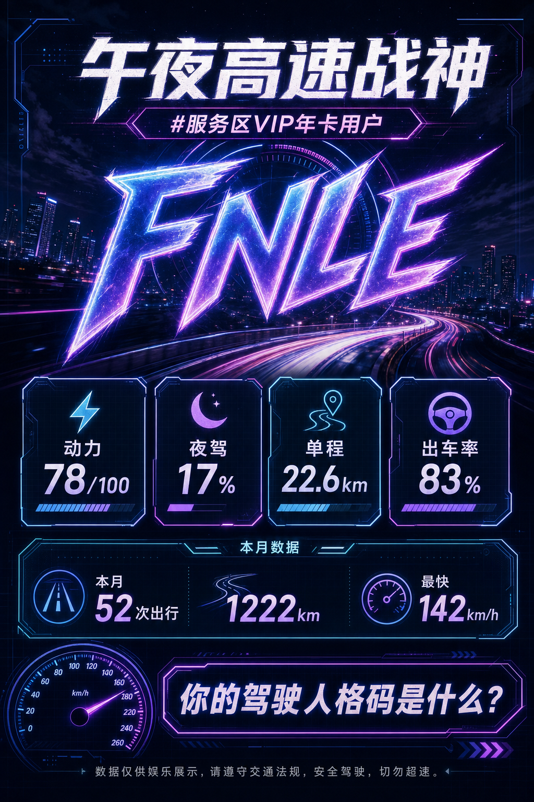
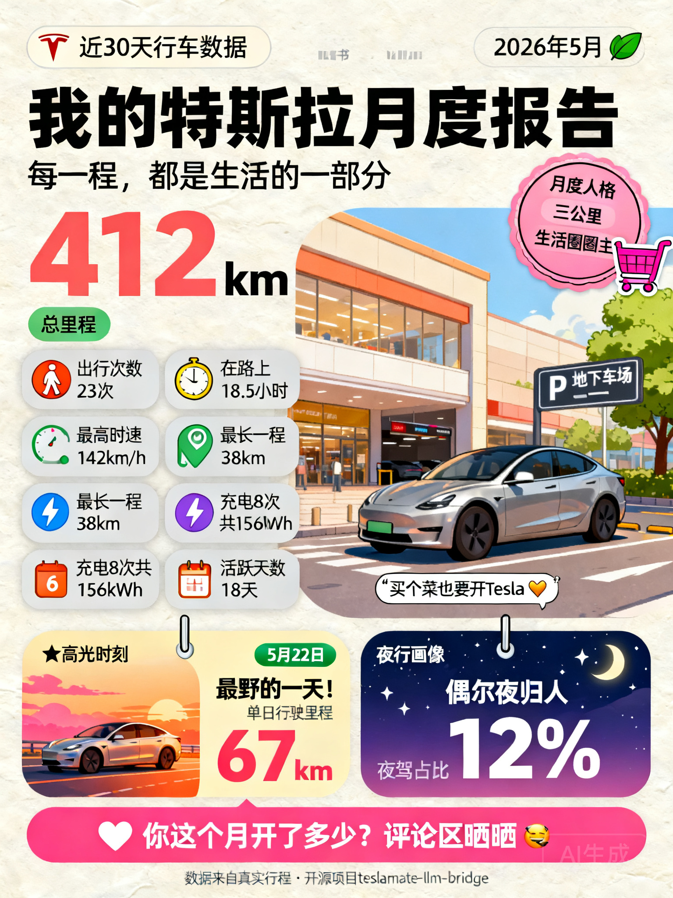
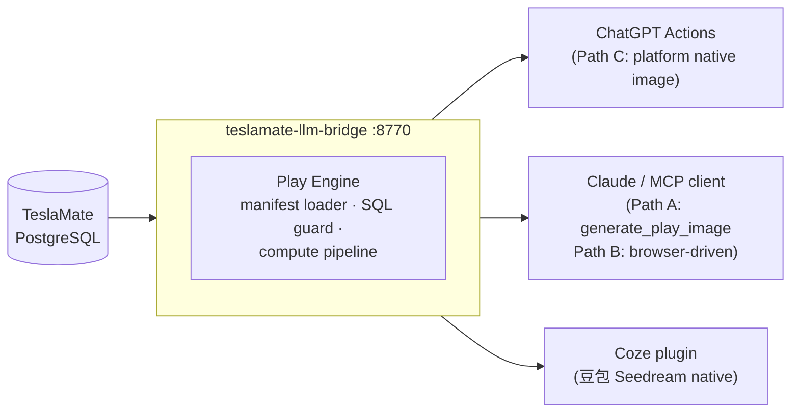

# teslamate-llm-bridge

<!-- CI badge — replace YOUR_GITHUB with your username/org before publishing -->
<!--  -->

**Bring your Tesla to any LLM platform** — driving personality scores, monthly wrapped, charging habits, and more, from your TeslaMate data.

**把你的 Tesla 接入任何 LLM 平台** —— 驾驶人格评分、月度战报、充电习惯等，全部来自你的 TeslaMate 数据。

```bash
# Demo quick start (no config needed — car_id=99 is synthetic data):
docker compose --profile demo up -d --build
# Then: curl http://localhost:8770/api/v1/cars/99/play/driving-personality
#
# Production (requires TeslaMate DB — copy .env.example to .env first):
# docker compose --profile prod up -d --build
# Then use your actual car_id: curl http://localhost:8770/api/v1/cars/1/play/driving-personality
```

## Gallery

| driving-personality FNLE「午夜高速战神」 | monthly-wrapped demo（30 天 1222 km） |
|---|---|
|  |  |

*Both images generated from demo data using Seedream 4.0 via `generate_play_image` MCP tool.*
*两张图均由 demo 数据经 `generate_play_image` MCP 工具调用 Seedream 4.0 生成。*

> **AI agents:** see [AGENTS.md](AGENTS.md) to add a play in ~10 min — no Java or Python required.
>
> **AI 编程 Agent：** 参阅 [AGENTS.md](AGENTS.md)，约 10 分钟新增一个玩法，不需要写 Java 或 Python。

> **Do not want to self-host?** Hosted version at [tesla.shenqinqin.com](https://tesla.shenqinqin.com) (China) — bind your car in 1 minute.
>
> **不想自己部署？** 国内托管版：[tesla.shenqinqin.com](https://tesla.shenqinqin.com)，绑车 1 分钟，即可在 ChatGPT / Coze / Claude 里跟自己的车对话、生成战绩卡片。

---

## What is this? / 这是什么？

[TeslaMate](https://github.com/teslamate-org/teslamate) already logs everything your Tesla does into PostgreSQL. This project turns that raw data into things an LLM can actually *talk about* and *turn into social-share images*:

[TeslaMate](https://github.com/teslamate-org/teslamate) 已经把你 Tesla 的一切行为写进了 PostgreSQL。本项目把这些原始数据变成 LLM 能真正「聊」的内容，并能生成可分享的图片：

**Two interfaces, cleanly separated / 两个接口，清晰分层：**

```
存储（TeslaMate）
    ↓
【接口一：数据读取】  ← plays = 读什么 + 怎么算 + 生图描述模板
    ↓
结构化 JSON + creative-prompt 模板
    ↓
【接口二：生图】  ← 渠道 × 接入方式 交叉矩阵
    ↓
分享图（小红书 / 朋友圈格式）
```

- **Plays (玩法)** — small, declarative YAML manifests: one read-only SQL query + a compute pipeline (scores, levels, personas) + a `creative-prompt.md` image template. Think "Spotify Wrapped, but for your car, one card at a time".
  每个玩法是一份小型声明式 YAML：一条只读 SQL + 计算管道（评分、等级、人格） + 生图提示词模板。可以理解为「Spotify Wrapped，但是给你的车，每次一张卡片」。
- **Multi-platform out of the box / 开箱即多平台** — the same play is exposed as a ChatGPT Actions endpoint, a Coze plugin tool, and an MCP tool. Write once, every assistant can call it.
  同一个玩法同时对外暴露为 ChatGPT Actions 接口、Coze 插件工具和 MCP 工具，写一次，所有助手都能调用。
- **Image generation via Interface 2 / 接口二生图** — three paths depending on what you have (see [AGENTS.md §Interface 2](AGENTS.md#interface-2--image-generation-guide-接口二生图使用手册)):
  三条路径，按你手头的资源选（详见 [AGENTS.md §Interface 2](AGENTS.md#interface-2--image-generation-guide-接口二生图使用手册)）：
  - **Path A — API direct**: `ARK_API_KEY` + `generate_play_image` MCP tool → Seedream 4.0, one-command poster
  - **Path B — Browser-driven**: Agent uses Chrome MCP to operate your logged-in ChatGPT / 豆包 web page
  - **Path C — Platform native**: You are in a ChatGPT / Coze conversation, platform generates images natively
- **Safe by construction / 内置安全沙箱** — plays are *not* raw SQL access. Every manifest passes a JSON-Schema gate, an SQL static guard (SELECT-only, no DDL/DML, statement-level timeout, read-only transaction), and a ~150-line arithmetic-only expression language before it is ever loaded.
  玩法不是裸 SQL 访问。每份 manifest 都要经过 JSON-Schema 校验、SQL 静态守卫（仅 SELECT、禁 DDL/DML、语句超时、只读事务）以及约 150 行纯算术表达式语言的检查，才会被加载。

---

## No TeslaMate yet? Try the demo in one command / 还没有 TeslaMate？一条命令体验 demo

```bash
# Pull the repo, then:
docker compose --profile demo up -d --build
```

This starts a local PostgreSQL and injects 45 days of synthetic driving data (Model Y LR, Shanghai scenario, `car_id=99`) — no `.env` configuration needed.

这会启动一个本地 PostgreSQL 并注入 45 天合成驾驶数据（Model Y LR，上海场景，`car_id=99`），无需任何 `.env` 配置。

Try any play right away / 立即尝试任意玩法：

```bash
# Driving personality / 驾驶人格
curl "http://localhost:8770/api/v1/cars/99/play/driving-personality"

# Charging habits / 充电习惯
curl "http://localhost:8770/api/v1/cars/99/play/charging-habit"

# Monthly wrapped / 月度战报
curl "http://localhost:8770/api/v1/cars/99/play/monthly-wrapped"
```

> Demo data is fully synthetic — no real VIN, no real GPS coordinates, no real owner.
> VIN is `DEMO0000000000001`. See [DEMO.md](DEMO.md) for the full dataset description.
>
> Demo 数据完全合成，无真实 VIN、无真实 GPS 坐标、无真实车主。VIN 为 `DEMO0000000000001`。完整数据集说明见 [DEMO.md](DEMO.md)。

---

## Quick Start / 快速上手

**Full installation guides (commands are tested, not examples) / 完整安装指南（命令经过测试，非示例）：**

- **[Install from scratch / 从零安装](docs/install-from-zero.md)** — no TeslaMate yet; covers TeslaMate + bridge in one go, demo mode, CN mirror acceleration
  还没有 TeslaMate；包含 TeslaMate + bridge 一步到位、demo 模式、国内镜像加速
- **[Add bridge to existing TeslaMate / 已有 TeslaMate 安装 bridge](docs/install-existing-teslamate.md)** — already running TeslaMate; covers TM_DB_HOST gotcha for containerized PG, prebuilt-jar option, security
  已经在跑 TeslaMate；涵盖容器化 PG 的 TM_DB_HOST 坑、预编译 jar 选项、安全配置

### Prerequisites / 前置要求

- Docker and Docker Compose
- An existing TeslaMate PostgreSQL instance (local or remote) / 已有 TeslaMate PostgreSQL 实例（本机或远端）
- Java 21+ — only needed if you prefer `java -jar` over Docker / 仅在用 `java -jar` 而非 Docker 时需要

You need to know: `TM_DB_HOST`, `TM_DB_PORT` (default `5432`), `TM_DB_NAME` (default `teslamate`), `TM_DB_USER` (default `teslamate`), `TM_DB_PASS`, and the `car_id` of your car in TeslaMate (run `SELECT id, name FROM cars;` against your TeslaMate DB to find it).

你需要知道：`TM_DB_HOST`、`TM_DB_PORT`（默认 `5432`）、`TM_DB_NAME`（默认 `teslamate`）、`TM_DB_USER`（默认 `teslamate`）、`TM_DB_PASS`，以及你的车在 TeslaMate 中的 `car_id`（对 TeslaMate DB 执行 `SELECT id, name FROM cars;` 查询获取）。

### 1. Clone the repo / 克隆仓库

```bash
git clone https://github.com/teslamate-llm-bridge/teslamate-llm-bridge.git
cd teslamate-llm-bridge
```

### 2. Configure environment / 配置环境

```bash
cp .env.example .env
```

Edit `.env` / 编辑 `.env`：

```dotenv
TM_DB_HOST=localhost          # hostname of your TeslaMate PostgreSQL
TM_DB_PORT=5432
TM_DB_NAME=teslamate
TM_DB_USER=teslamate
TM_DB_PASS=your_pg_password

# Optional: restrict to specific car IDs (comma-separated TeslaMate car IDs).
# 可选：限制允许查询的 car ID（英文逗号分隔）
CAR_IDS=1

# Optional: require a Bearer token on /api/** endpoints.
# 可选：为 /api/** 接口启用 Bearer token 鉴权
API_TOKEN=
```

### 3. Start the bridge / 启动 bridge

```bash
docker compose --profile prod up -d
```

> **First run or after upgrading:** add `--build` to force a fresh image build:
> `docker compose --profile prod up -d --build`
> Skip `--build` on subsequent runs to reuse the cached image.
>
> **首次运行或升级后：** 加 `--build` 强制重新构建镜像：
> `docker compose --profile prod up -d --build`
> 后续运行可省略 `--build` 复用缓存镜像。

The bridge starts on port **8770**. Startup takes ~10–30 seconds on first build (Maven download), ~5 seconds on cached runs.

Bridge 监听端口 **8770**。首次构建约 10–30 秒（Maven 下载），有缓存约 5 秒。

```bash
curl http://localhost:8080/actuator/health
# {"status":"UP"}
```

> If you see `404` for `/actuator/health`, the running image is stale. Run `docker compose --profile prod up -d --build` to rebuild.
>
> 如果 `/actuator/health` 返回 `404`，说明运行中的镜像是旧版本，执行 `docker compose --profile prod up -d --build` 重新构建。

### 4. List available plays / 列出可用玩法

```bash
curl http://localhost:8770/api/v1/plays
```

### 5. Run your first play / 跑第一个玩法

```bash
# Demo profile: car_id is always 99 / demo 模式：car_id 固定为 99
curl "http://localhost:8770/api/v1/cars/99/play/driving-personality"

# Production profile: replace 1 with your actual TeslaMate car_id
# 生产模式：把 1 替换为你在 TeslaMate 中的实际 car_id
# curl "http://localhost:8770/api/v1/cars/1/play/driving-personality"
```

Sample result / 示例返回：

```json
{
  "data": {
    "play": "driving-personality",
    "scored": true,
    "window_days": 30,
    "code": "FNLE",
    "persona": {
      "name": "午夜高速战神",
      "desc": "别人睡了你才上高速，电门深浅全凭心情。",
      "tag": "#服务区VIP年卡用户"
    },
    "summary": "近 30 天驾驶人格 FNLE：夜驾 17%、地板电时刻 27%、单程均 22.6 公里、出车率 83%。"
  }
}
```

### 6. Generate a share image / 生成分享图

Three paths — pick the one you have access to / 三条路径，按你的资源选：

**Path A — MCP + Seedream API (recommended for Claude Code users / 推荐 Claude Code 用户)**

```bash
# 1. Set your ARK_API_KEY in the MCP server config (see docs/connect-claude-mcp.md)
#    在 MCP server config 里配置 ARK_API_KEY（见 docs/connect-claude-mcp.md）
# 2. In Claude Desktop / Codex, ask:
#    在 Claude Desktop / Codex 里问：
#    「给我做张驾驶人格分享图」
# Claude will chain: list_plays → run_play → get_creative_prompt → generate_play_image
# Claude 会自动串联：list_plays → run_play → get_creative_prompt → generate_play_image
# → returns a 1080×1920 poster like the gallery images above
# → 返回一张 1080×1920 海报，效果见上方 Gallery
```

**Path B — Browser-driven ChatGPT / 豆包 / 浏览器驱动**

Have an Agent use Chrome MCP to open chatgpt.com, paste the filled creative-prompt template, and save the generated image. See [AGENTS.md §路径 B](AGENTS.md#路径-b--浏览器驱动chatgpt-网页--豆包网页).

让 Agent 用 Chrome MCP 打开 chatgpt.com，粘贴填好的 creative-prompt 模板，保存生成的图片。详见 [AGENTS.md §路径 B](AGENTS.md#路径-b--浏览器驱动chatgpt-网页--豆包网页)。

**Path C — Platform native (ChatGPT / Coze) / 平台原生**

Import the OpenAPI spec at `http://localhost:8770/openapi.json` into ChatGPT Actions or Coze. The platform's built-in image model (GPT Image / Seedream) generates the poster in the same conversation window.

把 `http://localhost:8770/openapi.json` 导入 ChatGPT Actions 或 Coze，平台内置图像模型（GPT Image / Seedream）在同一对话窗口里直接生图。

Full image generation guide / 完整生图指南：**[docs/image-generation.md](docs/image-generation.md)**

### 7. Connect to an LLM platform / 接入 LLM 平台

> **Security / 安全提醒：** Before exposing the bridge to the internet, set `API_TOKEN` in your `.env` file.
> Run: `echo "API_TOKEN=$(openssl rand -hex 32)" >> .env` then `docker compose --profile prod up -d --force-recreate bridge` (**not** `restart`).
>
> 向公网暴露 bridge 前，请在 `.env` 里设置 `API_TOKEN`。执行上方命令生成随机 token，然后用 `--force-recreate`（**不是** `restart`）重启服务使其生效。

- **ChatGPT Actions** — import `http://localhost:8770/openapi.json` (needs public HTTPS URL / 需要公网 HTTPS 地址): [docs/connect-chatgpt.md](docs/connect-chatgpt.md)
- **Claude Desktop / Cursor / Codex (MCP)** — local, no HTTPS needed / 本地运行，无需 HTTPS: [docs/connect-claude-mcp.md](docs/connect-claude-mcp.md)
- **Coze / 扣子** — needs public HTTPS URL / 需要公网 HTTPS 地址: [docs/connect-coze.md](docs/connect-coze.md)

### Alternative: run with `java -jar` (no Docker) / 备选：`java -jar` 直接运行（无需 Docker）

```bash
cd bridge
mvn -DskipTests package
java -Xmx256m \
  -DTM_DB_HOST=localhost \
  -DTM_DB_PASS=your_pg_password \
  -jar target/teslamate-llm-bridge-*.jar
```

### Custom plays directory / 自定义玩法目录

```yaml
# docker-compose.yml extension
services:
  bridge:
    environment:
      PLAYS_DIR: /plays-custom
    volumes:
      - ./my-plays:/plays-custom
```

---

## How it compares / 与同类项目对比

The closest neighbor is [cobanov/teslamate-mcp](https://github.com/cobanov/teslamate-mcp) — a great, minimal MCP server that exposes predefined SQL queries over your TeslaMate database.

最近的同类项目是 [cobanov/teslamate-mcp](https://github.com/cobanov/teslamate-mcp) —— 一个出色的轻量 MCP server，通过预定义 SQL 查询暴露 TeslaMate 数据。

| | teslamate-llm-bridge | cobanov/teslamate-mcp |
|---|---|---|
| Core idea / 核心理念 | Declarative **play framework**: query + compute pipeline + image template / 声明式**玩法框架**：查询 + 计算管道 + 生图模板 | MCP server with predefined raw SQL queries / 预定义原始 SQL 的 MCP server |
| Image output / 图片生成 | AI-generated share posters via 3-path Interface 2 (Seedream / GPT Image / ChatGPT native) / 三路径接口二生成 AI 分享海报 | None / 无 |
| Platforms / 平台支持 | **ChatGPT Actions, Coze plugin, MCP** from one definition / 同一定义同时对接三平台 | MCP clients only / 仅 MCP 客户端 |
| Sandboxing / 沙箱安全 | JSON-Schema gate, SQL static guard, read-only tx, 5s timeout, arithmetic-only expr / JSON-Schema 校验 + SQL 静态守卫 + 只读事务 + 5s 超时 + 纯算术表达式 | Queries are trusted as written / 信任原始 SQL |
| Contribution / 贡献方式 | A `plays/<name>/` YAML folder — **no Java/Python required** / 一个 YAML 文件夹，不用写代码 | New SQL query in codebase / 在代码库里加 SQL |

---

## Architecture / 架构



---

## Included plays / 内置玩法

| Play | What it tells you / 告诉你什么 |
|---|---|
| [`driving-personality`](plays/driving-personality/) 🧬 | 16-type MBTI-style personality from vigor, night-driving, radius, and frequency axes — 4-letter code (FNLE … CDSO) with Chinese persona name / 基于激情度、夜驾率、半径、频率四轴的 16 型驾驶人格，四字母代号 + 中文人格名 |
| [`monthly-wrapped`](plays/monthly-wrapped/) 📅 | Spotify Wrapped-style monthly report — total km, active days, busiest day, night profile / Spotify Wrapped 风格月报——总公里、活跃天、最忙一天、夜驾画像 |
| [`charging-habit`](plays/charging-habit/) ⚡ | Charging persona from anxiety level, full-charge habit, home vs DC split / 从焦虑指数、满充习惯、家充 vs 快充占比分析充电人格 |
| [`efficiency-report`](plays/efficiency-report/) 📊 | Energy efficiency grade vs TeslaMate baseline / 能耗效率评级（对比 TeslaMate 基准线） |
| [`extremes-card`](plays/extremes-card/) 🏆 | Personal records — top speed, peak power, max elevation / 个人纪录——最高速、峰值功率、最大海拔 |
| [`weekend-warrior`](plays/weekend-warrior/) 🗺️ | Weekend vs weekday driving split / 周末 vs 工作日驾驶对比 |
| [`ab-couple-souls`](plays/ab-couple-souls/) 💑 | Two-soul personality for couples sharing a car / 共用一辆车的情侣双人格分析 |

More plays / 更多玩法候选：see [`plays-incubator/`](plays-incubator/) for candidates.

---

## Play manifest at a glance / 玩法 manifest 速览

```yaml
schema_version: 1
name: driving-personality
title: "驾驶人格十六型"
sql: |
  SELECT COUNT(*) AS total_drives, ... FROM drives
  WHERE car_id = :car_id AND start_date >= :start AND start_date < :end
min_sample: { field: total_drives, min: 5 }
compute:
  - var: night_ratio
    expr: "ROUND(night_drives * 100 / GREATEST(total_drives, 1))"
  - var: personality_axis
    level:
      input: night_ratio
      thresholds:
        - { lt: 20, label: "D" }
        - { label: "N" }
output:
  fields:
    - { name: code, from: code, type: string }
    - { name: persona, from: persona, type: object }
```

Each play folder: `play.yaml` (manifest) + `creative-prompt.md` (image generation templates) + `fixtures.yaml` (CI test cases).

每个玩法文件夹：`play.yaml`（manifest）+ `creative-prompt.md`（生图提示词模板）+ `fixtures.yaml`（CI 测试用例）。

Full specification / 完整规范：[`docs/play-manifest-spec.md`](docs/play-manifest-spec.md). Schema: [`plays/play.schema.json`](plays/play.schema.json).

---

## MCP (Claude Desktop / Cursor / Codex)

4 tools over `stdio` — no public HTTPS URL required / 4 个工具通过 `stdio` 暴露，无需公网 HTTPS：

| Tool | What it does / 功能 |
|---|---|
| `list_plays` | List all loaded plays (name, title, emoji, description) / 列出所有已加载玩法 |
| `run_play` | Run a play for a given car and time window, returns structured JSON / 对指定车辆和时间窗运行玩法，返回结构化 JSON |
| `get_creative_prompt` | Fetch a play's `creative-prompt.md` template (v1 universal + v2 Seedream-tuned) / 获取玩法的生图提示词模板 |
| `generate_play_image` | Call 火山方舟 Seedream-4.0 to generate the poster image (China direct, no VPN, 200 free images for new users) / 调用火山方舟 Seedream-4.0 生成海报（国内直连，无需 VPN，新用户 200 张免费额度） |

Quick setup / 快速配置（full guide / 完整指南：[docs/connect-claude-mcp.md](docs/connect-claude-mcp.md)）：

```bash
# macOS Homebrew Python 3.12+: add --break-system-packages (or use a venv)
pip install --break-system-packages -e mcp-server/
# Alternative (clean env): python3 -m venv ~/.venv/teslabridge && source ~/.venv/teslabridge/bin/activate && pip install -e mcp-server/
```

Add to `~/Library/Application Support/Claude/claude_desktop_config.json`:

```json
{
  "mcpServers": {
    "teslamate-bridge": {
      "command": "python3",
      "args": ["/absolute/path/to/teslamate-llm-bridge/mcp-server/server.py"],
      "env": {
        "BRIDGE_URL": "http://localhost:8770",
        "BRIDGE_API_TOKEN": "your-token",
        "ARK_API_KEY": "your-ark-api-key-here"
      }
    }
  }
}
```

Then restart Claude Desktop and ask / 重启 Claude Desktop 后直接问：`给我做张驾驶人格分享图` — Claude chains `list_plays` → `run_play` → `get_creative_prompt` → `generate_play_image` and returns the poster / Claude 自动串联四个工具并返回海报。

---

## Contributing plays / 贡献玩法

- Humans / 开发者：read [`docs/play-manifest-spec.md`](docs/play-manifest-spec.md), copy an existing play folder, open a PR. 欢迎用中文提交玩法创意（Issue 选 "New play proposal" 模板），玩法文案以中文为一等公民。
- AI coding agents (Claude Code, Cursor, Codex, …): follow [`AGENTS.md`](AGENTS.md) — it is written for you. AI 编程 Agent 请直接遵循 [`AGENTS.md`](AGENTS.md)，这份文档专为 Agent 编写。
- Want ideas? / 想找灵感？See [`docs/good-first-issues.md`](docs/good-first-issues.md).

No Java or Python required. Run validation locally / 不需要 Java 或 Python，本地跑校验：

```bash
pip install pyyaml
python3 tools/validate_plays.py
```

---

## Status & Roadmap / 状态与路线图

- [x] Play manifest spec v1 — frozen, JSON Schema published / 玩法 manifest 规范 v1 已冻结，JSON Schema 已发布
- [x] 7 plays with CI fixtures (`driving-personality`, `monthly-wrapped`, `charging-habit`, `efficiency-report`, `extremes-card`, `weekend-warrior`, `ab-couple-souls`) / 7 个玩法含 CI 测试用例
- [x] Play engine — Spring Boot 3.3, SQL guard, compute pipeline / 玩法引擎（Spring Boot 3.3 + SQL 守卫 + 计算管道）
- [x] `StaticTokenFilter` — Bearer API_TOKEN auth / Bearer token 鉴权
- [x] `/openapi.json` static spec served for LLM platform import / 静态 OpenAPI spec 供平台导入
- [x] CI play validation — JSON Schema (ajv) + engine-mirror fixture runner / CI 玩法校验
- [x] MCP server — 4 tools: `list_plays` / `run_play` / `get_creative_prompt` / `generate_play_image`
- [x] Demo mode — 45-day synthetic data, `docker compose --profile demo up -d` / Demo 模式，45 天合成数据
- [x] Interface 2 image generation — Seedream 4.0 API + browser-driven + platform native documented / 接口二生图三路径文档完整
- [ ] Pre-built Docker image published to GHCR / 预构建 Docker 镜像发布到 GHCR

---

## License

[AGPL-3.0](LICENSE). Plays (YAML manifests, fixtures, creative prompts) contributed to this repo are accepted under the same license.

[AGPL-3.0](LICENSE)。向本仓库贡献的玩法（YAML manifest、fixtures、creative prompts）均以相同协议接受。

## Trademark notice / 商标免责声明

This project is an unofficial community tool and is not affiliated with, endorsed by, or supported by the official [TeslaMate](https://github.com/teslamate-org/teslamate) project. Tesla is a trademark of Tesla, Inc.; this project is not affiliated with Tesla, Inc.

本项目为非官方社区工具，与官方 [TeslaMate](https://github.com/teslamate-org/teslamate) 项目无关联、无背书、无支持关系。Tesla 是 Tesla, Inc. 的商标；本项目与 Tesla, Inc. 无任何关联。
