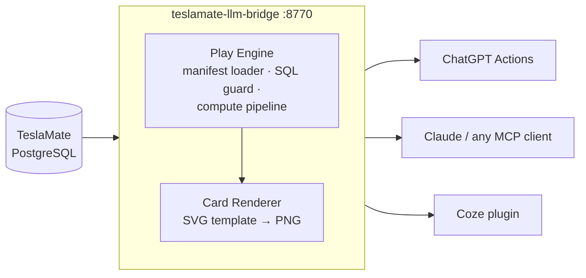

# teslamate-llm-bridge

<!-- CI badge — replace YOUR_GITHUB with your username/org before publishing -->
<!--  -->

**Bring your Tesla to any LLM platform** — scoring, shareable cards, and a declarative play framework on top of TeslaMate.

```bash
# One-line quick start (after filling .env with your TeslaMate DB creds):
docker compose --profile prod up -d
# Then: curl http://localhost:8770/api/v1/cars/1/play/driving-personality
```

> **Hero image placeholder** — add a `driving-personality` card screenshot here before publishing.
> Path: `docs/gallery/driving-personality-sample.png`

> **AI agents:** see [AGENTS.md](AGENTS.md) to add a play in ~10 min — no Java or Python required.

> **Do not want to self-host?** Hosted version at [tesla.shenqinqin.com](https://tesla.shenqinqin.com) (China) — bind your car in 1 minute.

## What is this?

[TeslaMate](https://github.com/teslamate-org/teslamate) already logs everything your Tesla does into PostgreSQL. This project turns that raw data into things an LLM can actually *talk about*:

- **Plays (玩法)** — small, declarative YAML manifests that define one read-only SQL query, a compute pipeline (scores, levels, personas), and an optional 1080×1080 PNG share card. Think "Spotify Wrapped, but for your car, one card at a time".
- **Multi-platform out of the box** — the same play is exposed as a ChatGPT Actions endpoint, a Coze plugin tool, and an MCP tool. Write once, every assistant can call it.
- **Safe by construction** — plays are *not* raw SQL access. Every manifest passes a JSON-Schema gate, an SQL static guard (SELECT-only, no DDL/DML, statement-level timeout, read-only transaction), a ~150-line arithmetic-only expression language (no SpEL, no method calls), and an SVG template lint before it is ever loaded.

## No TeslaMate yet? Try the demo in one command

If you do not have a TeslaMate instance, use the built-in demo mode to experience all plays instantly:

```bash
# Pull the repo, then:
docker compose --profile demo up -d
```

This starts a local PostgreSQL and injects 45 days of synthetic driving data (Model Y LR, Shanghai scenario, `car_id=99`) — no `.env` configuration needed.

Try any play right away:

```bash
# Driving personality
curl "http://localhost:8770/api/v1/cars/99/play/driving-personality"

# Charging habits
curl "http://localhost:8770/api/v1/cars/99/play/charging-habit"

# Monthly wrapped
curl "http://localhost:8770/api/v1/cars/99/play/monthly-wrapped"

# Download a shareable 1080x1080 PNG card
curl "http://localhost:8770/api/v1/cars/99/play/driving-personality/card.png" -o card.png
```

> Demo data is fully synthetic — no real VIN, no real GPS coordinates, no real owner.
> VIN is `DEMO0000000000001`. See [DEMO.md](DEMO.md) for the full dataset description.

---

## Quick Start

### Prerequisites

- Docker and Docker Compose
- An existing TeslaMate PostgreSQL instance (local or remote)
- Java 21+ — only needed if you prefer `java -jar` over Docker

You need to know: `TM_DB_HOST`, `TM_DB_PORT` (default `5432`), `TM_DB_NAME` (default `teslamate`), `TM_DB_USER` (default `teslamate`), `TM_DB_PASS`, and the `car_id` of your car in TeslaMate (run `SELECT id, name FROM cars;` against your TeslaMate DB to find it).

### 1. Clone the repo

```bash
git clone https://github.com/teslamate-llm-bridge/teslamate-llm-bridge.git
cd teslamate-llm-bridge
```

### 2. Configure environment

```bash
# Copy the example env file and fill in your TeslaMate DB connection
cp .env.example .env
```

Edit `.env`:

```dotenv
TM_DB_HOST=localhost          # hostname of your TeslaMate PostgreSQL
TM_DB_PORT=5432
TM_DB_NAME=teslamate
TM_DB_USER=teslamate
TM_DB_PASS=your_pg_password

# Optional: restrict to specific car IDs (comma-separated TeslaMate car IDs).
# Leave blank to allow all cars (single-tenant mode).
CAR_IDS=1

# Optional: require a Bearer token on /api/** endpoints.
# Leave blank to run without authentication (local dev mode — a WARN is logged).
API_TOKEN=
```

### 3. Start the bridge

```bash
docker compose --profile prod up -d
```

The bridge starts on port **8770** and loads the built-in play at startup. Startup takes ~5 seconds (Spring Boot + Batik font scan).

Verify it is healthy:

```bash
curl http://localhost:8770/actuator/health
# {"status":"UP"}
```

### 4. List available plays

```bash
curl http://localhost:8770/api/v1/plays
```

Expected response:

```json
{
  "data": {
    "plays": [
      { "name": "driving-personality", "title": "驾驶人格十六型", "has_card": true, ... }
    ]
  }
}
```

If you set `API_TOKEN`, add `-H "Authorization: Bearer <token>"` to every `curl` call below.

### 5. Run your first play

Replace `1` with your TeslaMate `car_id`:

```bash
curl "http://localhost:8770/api/v1/cars/1/play/driving-personality"
```

Scored result example:

```json
{
  "data": {
    "play": "driving-personality",
    "scored": true,
    "window_days": 30,
    "code": "CNSO",
    "persona": {
      "name": "深夜静音幽灵",
      "desc": "很少出动，一动就是深夜悄悄滑过街角。",
      "tag": "#电机声都嫌吵"
    },
    "summary": "近 30 天驾驶人格 CNSO：夜驾 18%、地板电时刻 4%、单程均 9.3 公里、出车率 52%。"
  }
}
```

If you get `"scored": false`, the play did not find enough data in the default 30-day window. Try a wider window:

```bash
curl "http://localhost:8770/api/v1/cars/1/play/driving-personality?start_date=2024-01-01"
```

### 6. Get a share card (PNG)

```bash
curl -o card.png "http://localhost:8770/api/v1/cars/1/play/driving-personality/card.png"
open card.png   # macOS
```

The engine renders a 1080×1080 PNG with your persona and stats. CJK fonts are bundled in the Docker image.

### 7. Connect to an LLM platform

> **Security:** Before exposing the bridge to the internet, set `API_TOKEN` in your `.env` file
> and optionally restrict access to specific car IDs with `CAR_IDS`.
> Run: `echo "API_TOKEN=$(openssl rand -hex 32)" >> .env` then apply it with `docker compose --profile prod up -d --force-recreate bridge` (**not** `restart` — `restart` does not re-read `.env`).
> Without `API_TOKEN`, any internet user with the URL can read your complete TeslaMate history.

- **ChatGPT Actions** — import `http://localhost:8770/openapi.json` (needs public HTTPS URL): [docs/connect-chatgpt.md](docs/connect-chatgpt.md)
- **Claude Desktop / Cursor / Codex (MCP)** — local, no HTTPS needed: [docs/connect-claude-mcp.md](docs/connect-claude-mcp.md)
- **Coze / 扣子** — needs public HTTPS URL: [docs/connect-coze.md](docs/connect-coze.md)

After connecting, plays that return a shareable image prompt can be turned into a social card with your preferred image model. See **[docs/image-generation.md](docs/image-generation.md)** for a platform-by-platform matrix (GPT Image, 豆包, Qwen-Image, Gemini, Pollinations) and a quick decision tree for players who only have Claude.

The OpenAPI spec is always available at `GET /openapi.json` on your running bridge.

### Alternative: run with `java -jar` (no Docker)

```bash
# Requires Java 21+ and fonts-noto-cjk (for card rendering)
cd bridge
mvn -DskipTests package
java \
  -Xmx256m \
  -DTM_DB_HOST=localhost \
  -DTM_DB_PASS=your_pg_password \
  -jar target/teslamate-llm-bridge-*.jar
```

Environment variables work too: `export TM_DB_PASS=... && java -jar target/teslamate-llm-bridge-*.jar`

Note: card rendering requires CJK fonts. On macOS they are usually present; on Linux install `fonts-noto-cjk` first.

### Custom plays directory

Mount your own plays on top of the built-in ones:

```yaml
# docker-compose.yml (extend the default)
services:
  bridge:
    environment:
      PLAYS_DIR: /plays-custom
    volumes:
      - ./my-plays:/plays-custom
```

Plays in `PLAYS_DIR` are loaded in addition to the classpath plays. A play in `PLAYS_DIR` with the same name as a built-in play overrides it.

## How it compares

The closest neighbor is [cobanov/teslamate-mcp](https://github.com/cobanov/teslamate-mcp) — a great, minimal MCP server that exposes predefined SQL queries over your TeslaMate database. We aim at a different layer:

| | teslamate-llm-bridge | cobanov/teslamate-mcp |
|---|---|---|
| Core idea | Declarative **play framework**: query + compute pipeline + share card, packaged as one YAML folder | MCP server with a set of predefined raw SQL queries |
| Output | Structured JSON **and rendered PNG share cards** (1080×1080, CJK fonts) | Query result rows |
| Platforms | **ChatGPT Actions, Coze plugin, MCP** from one definition | MCP clients (Claude Desktop, etc.) |
| Sandboxing | JSON-Schema gate, SQL static guard, read-only tx, 5s timeout, arithmetic-only expr language, SVG lint | Queries are trusted as written |
| Contribution unit | A `plays/<name>/` folder — YAML + SVG template + fixtures, **no Java/Python required** | A new SQL query in the codebase |
| Multi-tenant | Designed for shared TeslaMate instances (per-car scoping is enforced by the engine) | Single-user self-host |

If you just want ad-hoc SQL answers in Claude Desktop, use teslamate-mcp — it is simpler. If you want packaged, shareable, platform-agnostic "car personality" features that non-programmers (or coding agents) can contribute, that is what this project is for.

## Architecture



A play request flows: platform calls one HTTP endpoint → engine runs the play's read-only query (bound to *your* `car_id` only) → compute pipeline produces scores/labels/personas → response is JSON, or a PNG card rendered from the play's SVG template.

## Included plays

| Play | What it tells you | Card |
|---|---|---|
| [`driving-personality`](plays/driving-personality/) 🧬 | 16-type MBTI-style personality from vigor, night-driving, radius, and frequency axes — produces a 4-letter code (FNLE … CDSO) with a Chinese persona name and one-liner | PNG |

More plays are coming — see [`plays-incubator/`](plays-incubator/) for candidates in progress, and [`docs/good-first-issues.md`](docs/good-first-issues.md) for community ideas.

Each play folder is self-contained: `play.yaml` (manifest), optional `card.svg.tmpl` (share card), and `fixtures.yaml` (CI test cases — required).

## Play manifest at a glance

```yaml
schema_version: 1
name: driving-personality
title: "驾驶人格十六型"
sql: |
  SELECT COUNT(*) AS total_drives, ... FROM drives
  WHERE car_id = :car_id AND start_date >= :start AND start_date < :end
min_sample: { field: total_drives, min: 5 }
compute:
  - var: night_ratio
    expr: "ROUND(night_drives * 100 / GREATEST(total_drives, 1))"
  - var: personality_axis
    level:
      input: night_ratio
      thresholds:
        - { lt: 20, label: "D" }
        - { label: "N" }
output:
  fields:
    - { name: code, from: code, type: string }
    - { name: persona, from: persona, type: object }
card: { template: card.svg.tmpl }
```

Full specification: [`docs/play-manifest-spec.md`](docs/play-manifest-spec.md). Machine-readable schema: [`plays/play.schema.json`](plays/play.schema.json).

## Contributing plays

- Humans: read [`docs/play-manifest-spec.md`](docs/play-manifest-spec.md), copy an existing play folder, open a PR.
- AI coding agents (Claude Code, Cursor, Codex, …): follow [`AGENTS.md`](AGENTS.md) — it is written for you.
- Want ideas? See [`docs/good-first-issues.md`](docs/good-first-issues.md) or open a [play proposal](.github/ISSUE_TEMPLATE/new-play.md).

No Java or Python required to contribute a play. The spec is frozen, fixtures define expected behaviour, and CI validates every manifest. Run validation locally:

```bash
pip install pyyaml
python3 tools/validate_plays.py
```

## MCP (Claude Desktop / Cursor / Codex)

The included Python MCP server in `mcp-server/` exposes three tools over `stdio` — no public HTTPS URL required:

| Tool | What it does |
|---|---|
| `list_plays` | List all loaded plays (name, title, emoji, description, has_card) |
| `run_play` | Run a play for a given car and time window, returns structured JSON |
| `render_play_card` | Render a 1080×1080 PNG share card, returned as base64 (Claude Desktop renders inline) |
| `generate_play_image` | 调用火山方舟 Seedream-4.0 文生图，传入填好的 creative-prompt 模板，返回生成图片（中国大陆直连，需设置 `ARK_API_KEY`） |

Quick setup (full guide: [docs/connect-claude-mcp.md](docs/connect-claude-mcp.md)):

```bash
# 1. Install Python deps
pip install -e mcp-server/

# 2. Add to ~/Library/Application Support/Claude/claude_desktop_config.json
{
  "mcpServers": {
    "teslamate-bridge": {
      "command": "python3",
      "args": ["/absolute/path/to/teslamate-llm-bridge/mcp-server/server.py"],
      "env": {
        "BRIDGE_URL": "http://localhost:8770",
        "BRIDGE_API_TOKEN": "your-token"
      }
    }
  }
}
```

Then restart Claude Desktop and ask: `列出所有可用玩法` — Claude calls `list_plays` and shows the available play.

---

## Status & Roadmap

- [x] Play manifest spec v1 — frozen, JSON Schema published
- [x] One reference play with CI fixtures (`driving-personality`); more in [`plays-incubator/`](plays-incubator/)
- [x] Play engine — Spring Boot 3.3, SQL guard, compute pipeline, Batik PNG renderer
- [x] `StaticTokenFilter` — Bearer API_TOKEN auth (same pattern as teslamateapi)
- [x] `/openapi.json` static spec served for LLM platform import
- [x] CI play validation — JSON Schema (ajv) + engine-mirror fixture runner
- [x] MCP server (`mcp-server/`) — Claude Desktop / Cursor / Codex, stdio transport, 3 tools
- [ ] Pre-built Docker image published to GHCR (currently: `docker compose up` builds locally)
- [ ] Configurable card themes ([good first issue](docs/good-first-issues.md))

## 中文车主社区

本项目源自杭州 Tesla 车友的共享 TeslaMate 服务。不想自己折腾部署的国内车主，可以直接用托管版 [tesla.shenqinqin.com](https://tesla.shenqinqin.com)：绑车 1 分钟，即可在 ChatGPT / Coze / Claude 里跟自己的车对话、生成战绩卡片。玩法（play）以中文文案为一等公民——欢迎直接用中文提交玩法创意（Issue 选 "New play proposal" 模板，中英文皆可）。

## License

[AGPL-3.0](LICENSE). Plays (YAML manifests, SVG templates, fixtures) contributed to this repo are accepted under the same license.

## Trademark notice

This project is an unofficial community tool and is not affiliated with, endorsed by, or supported by the official [TeslaMate](https://github.com/teslamate-org/teslamate) project. Tesla is a trademark of Tesla, Inc.; this project is not affiliated with Tesla, Inc.
